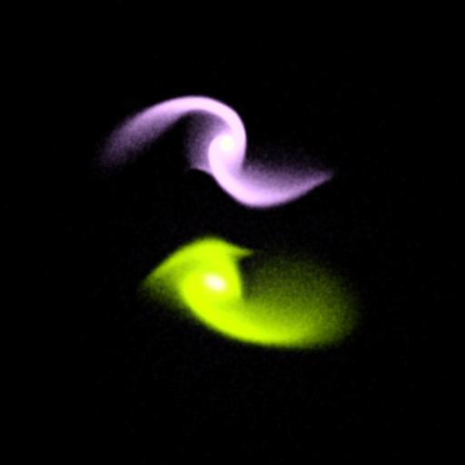
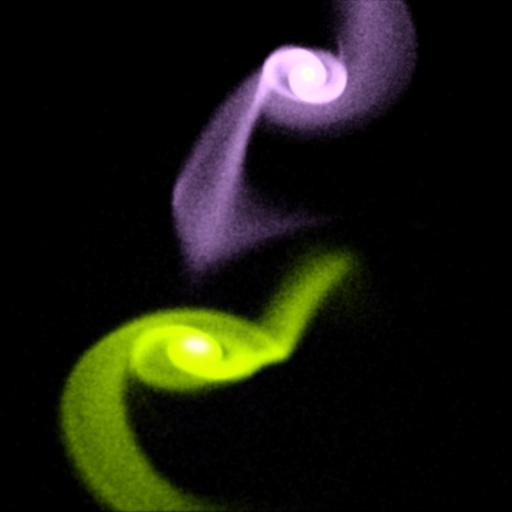
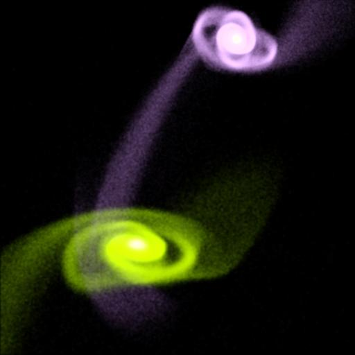
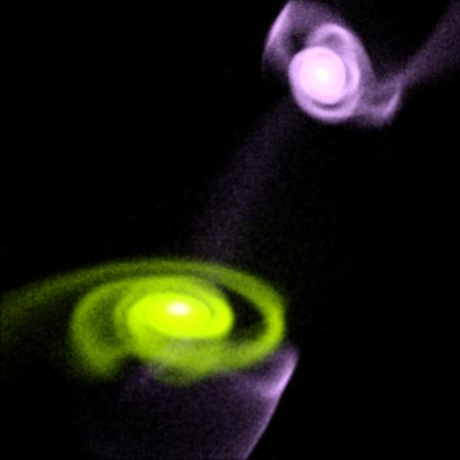
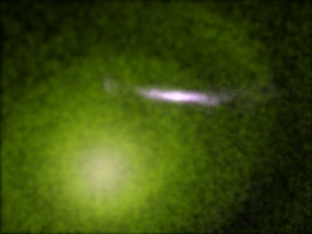

#StarSplatter Sample Images#

This document contains sample images and animations produced with the
*StarSplatter* renderer for astrophysical particle data.

These images show stages of a 3.5M particle evolution using a 
self-consistent field method, done at the Pittsburgh Supercomputing
Center by Joel Welling and John Dubinski.  This is a model of the merger
of the Milky Way and Andromeda Galaxies, to take place in roughly 5
billion years.  The bluish galaxy is our Milky Way. 

This image was produced with roughly 500K particles.  It shows a view
of the (simulated) Milky Way Galaxy as seen through the disk of Andromeda,
as per an old simulation by John Dubinski.

