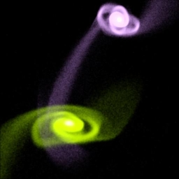

# StarSplatter Home Document #

(Galaxy merger image by Joel Welling and John Dubinski)

StarSplatter is a tool for creating images and animations from astrophysical
particle simulation data.  It treats each particle as a Gaussian "blob",
with an exponential fall-off similar to the SPH smoothing length or
gravitational softening length common in astrophysics simulations.  It
also properly anti-aliases points, so even if the particles are very small
the results may look better than one would get by simply binning particle
counts to produce an intensity image.

<!-- 
StarSplatter runs under the control of the 
<a href="http://sunscript.sun.com/">Tcl</a> scripting language 
(see also <a href="http://www.neosoft.com/tcl/tclhtml/Tcl.html">here</a>).
This allows it to be easily integrated with other programs;  it is also
easy to set up scripts to render animations.  StarSplatter is designed
to work with 
<a href="http://hermes.astro.washington.edu/tools/TIPSY/">TIPSY</a>, a
package for analyzing particle simulation data.
-->

This software was developed at the
[Pittsburgh Supercomputing Center](https://www.psc.edu)
in association with the 
[Grand Challenge Cosmology Consortium](http://zeus.ncsa.uiuc.edu:8080/GC3_Home_Page.html)
Funding was provided by the
[National Science Foundation](https://www.nsf.gov/).

## Documents ##

*[Some sample images](samples.md)
<!-- <li><a href="starsplatter_users_guide_tcl.html">StarSplatter Tcl User's Guide</a> -->
<!-- <li><a href="ftp://ftp.psc.edu/pub/starsplatter">Download the Software</a> -->

## Related Links ##

* [Frank Summers]("http://research.amnh.org/~summers/")
has been using StarSplatter to produce images and
animations of 
[starfields]("http://research.amnh.org/~summers/starsplatter/starsplatter.html")
starfields</a>, rather than of whole galaxies.  For example, he has
some nice views of Orion and of stars known to have planetary systems.

* Frank, [Chris Mihos]("http://burro.astr.cwru.edu/")
and [Sean Maxwell](http://burro.astr.cwru.edu/maxwell/)
have used StarSplatter to generate animations of 
[galaxy mergers](http://research.amnh.org/~summers/mihos/mihos.html).

